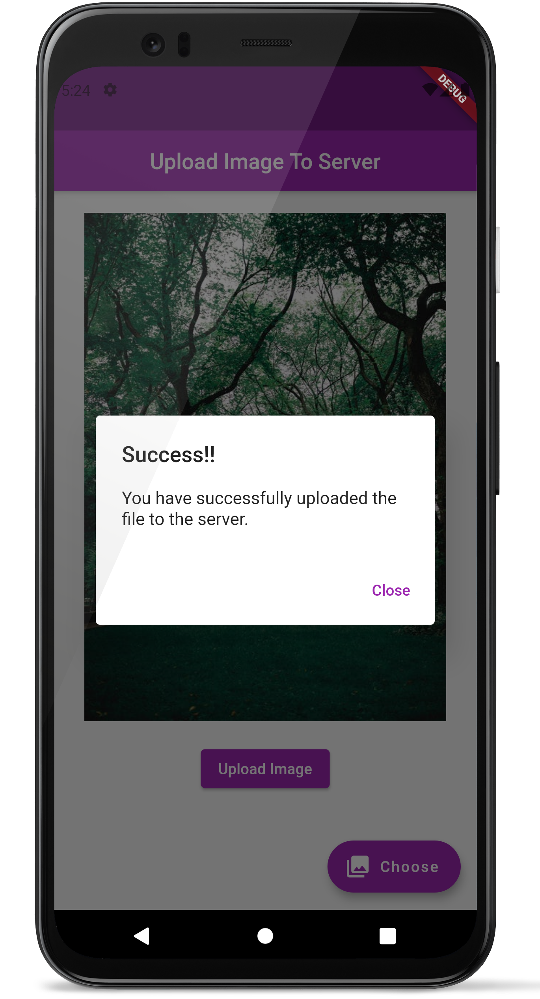

# Image Uploader App

A flutter based app that uploads any image from the device's gallery to a server using the POST request

## Feautures

* Users can add any image from the gallery
* Neat UI design
* Uses POST request to upload image

## Screenshots (Android)

 
 

## To run this app
* Replace the URL in myhomepage.dart with your API endpoint.
* Run the app with <b>flutter run</b>